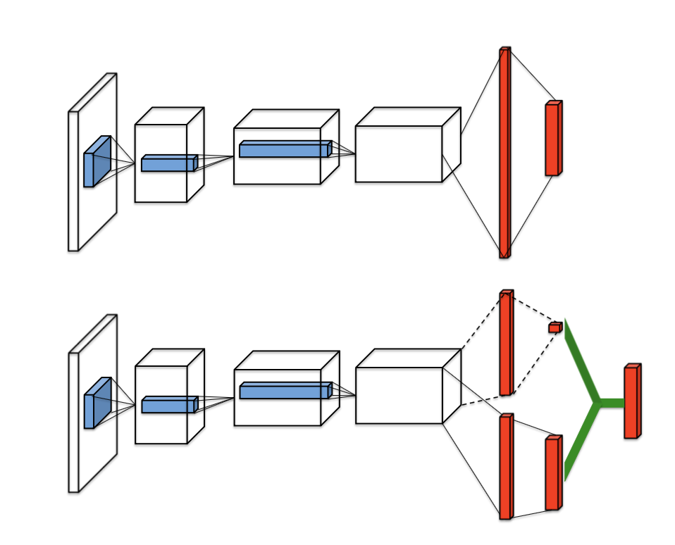
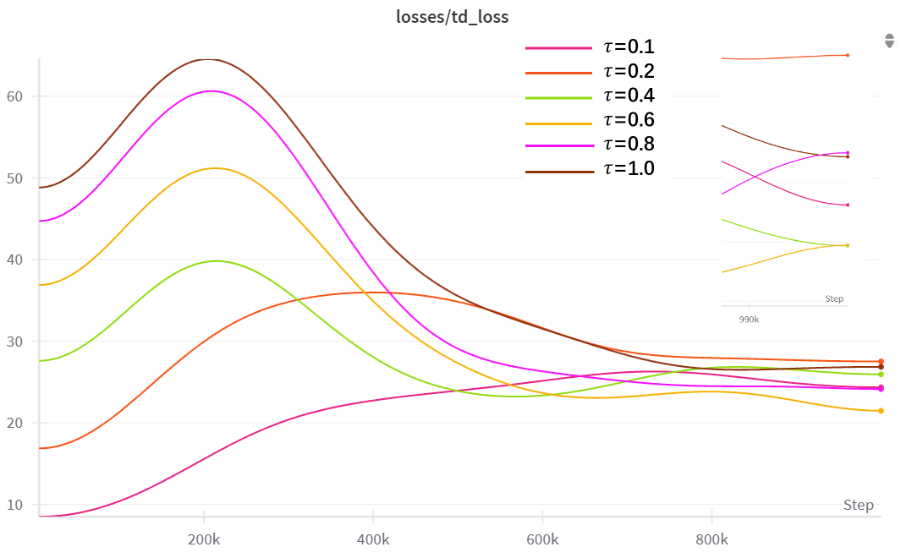
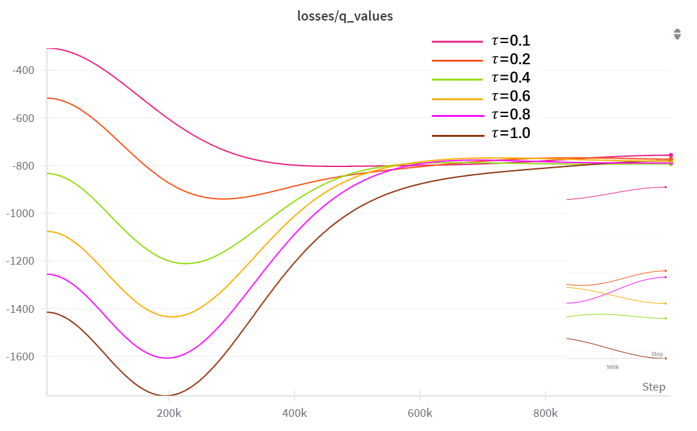
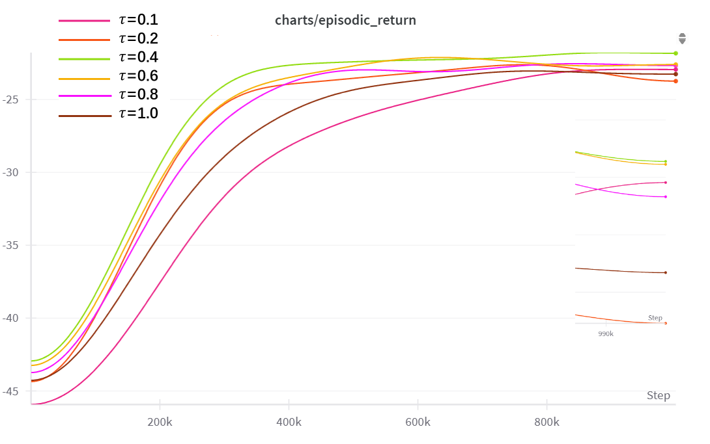
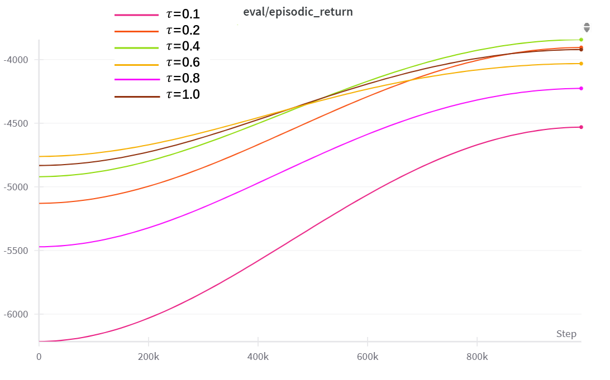
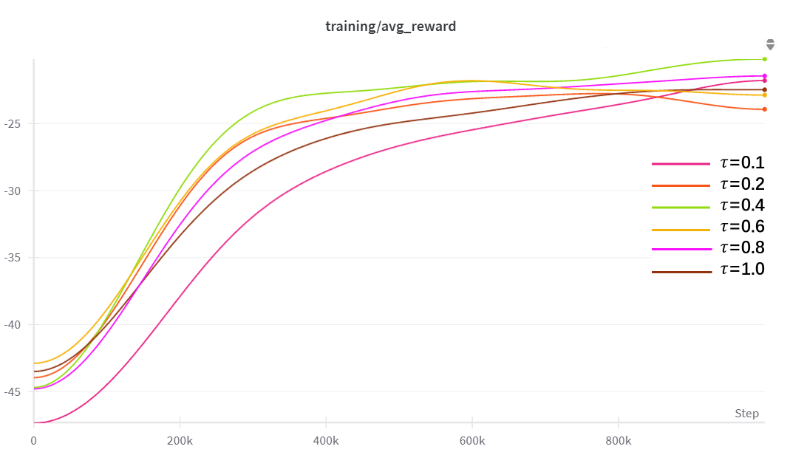
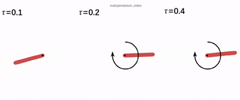

# 强化学习任务：倒立摆

## 项目介绍

实现的场景：

- 倒立摆
- 冰球游戏（待更新）

当前复现的深度强化学习算法：

- DQN
- DDQN
- Dueling DQN
- DDPG

运行方式：

```bash
# 默认配置：mode=train, algorithm=dqn, model_path=None
python main.py

# 使用dueling dqn 训练
python main.py -a dueling

# 测试，模型路径[models/{project_name}/{algorithm}/{run_id}.pth]
python main.py -m test -a dueling -p models/inverted-pendulum/dueling/962k5war.pth
```

超参数配置，见`./config.py`

## 任务描述


### 具体要求

倒立摆系数参数如下表：

| 变量 | 取值        | 单位     | 含义             |
| ---- | ----------- | -------- | ---------------- |
| *m*  | 0.055       | kg       | 重量             |
| *g*  | 9.81        | m/s²     | 重力加速度       |
| *l*  | 0.042       | m        | 重心到转子的距离 |
| *J*  | 1.91 × 10⁻⁴ | kg·m²    | 转动惯量         |
| *b*  | 3 × 10⁻⁶    | Nm·s/rad | 粘滞阻尼         |
| *K*  | 0.0536      | Nm/A     | 转矩常数         |
| *R*  | 9.5         | Ω        | 转子电阻         |

采样时间 $T_s$ 选取0.005s，离散时间动力学 $f$ 可以使用欧拉法获得
$$
\left\{
\begin{array}{l}
\alpha_{k+1} = \alpha_k + T_s \dot{\alpha}_k \\
\dot{\alpha}_{k+1} = \dot{\alpha}_k + T_s \ddot{\alpha} (\alpha_k, \dot{\alpha}_k, a_k)
\end{array}
\right.
$$
折扣因子选取 $\gamma=0.98$。选取较高折扣因子的目的是为了提高目标点(顶点)附近奖励在初始时刻状态价值的重要性，这样最优策略能够以成功将摆杆摆起并稳定作为最终目标。

（Tip：可以将动作空间离散化成 {−3,0,3} 三个动作，以这三个动作作为动作集学习最优策略。）

## 创建自定义环境

### 经典控制场景

​ `gymnasium` 中实现了经典控制环境倒立摆，可以作为[参考](https://gymnasium.farama.org/environments/classic_control/pendulum/)。


​ 值得注意的是，这里是使用超过最大时间步数时截断环境来限制环境的步数。（本来想的是直接根据任务要求通过判断当前状态是否接近[0, 0]来返回是否完成任务。）

```python
def step():
    ...
    # truncation=False as the time limit is handled by the `TimeLimit` wrapper added during `make`
    return self._get_obs(), -costs, False, False, {}
```

​ 此外状态重置是通过均匀分布采样，而非每次从初始状态开始，仔细想这样做是增加探索，有利于学习。

```python
self.state = self.np_random.uniform(low=low, high=high)
```

### 设计实现

```python
class InvertedPendulumEnv(gym.Env):
    
    metadata = {
        "render_modes": ["human", "rgb_array"],
        "render_fps": 30,
    }
    
    def __init__(self, 
                 max_episode_steps: int = 200, 
                 normalize_state: bool = False, 
                 discrete_action: bool = False, 
                 render_mode: Optional[str] = 'human'):
        super(InvertedPendulumEnv, self).__init__()
        
        self.max_episode_steps = max_episode_steps
        self.steps = 0
        self.n_actions = 3     # 离散动作数量
        self.max_voltage = 3.0  # 最大电压
        self.l = 0.042            # 摆杆长度 (m)
        self.m = 0.055            # 质量 (kg)
        self.J = 1.91 * 1e-4          # 转动惯量 (kg⋅m²)
        self.g = 9.81                   # 重力加速度 (m/s²)
        self.b = 3 * 1e-6        # 阻尼系数 (N⋅m⋅s/rad)
        self.K = 0.0536           # 转矩常数 (N⋅m/A)
        self.R = 9.5            # 电机电阻 (Ω)
        
        self.render_mode = render_mode
        self.discrete_action = discrete_action
        self.normalize_state = normalize_state

        self.last_u = 0
        self.screen_dim = 500
        self.screen = None
        self.clock = None
        self.isopen = True
        
        self.state_bounds = {
            'alpha': (-np.pi, np.pi),
            'alpha_dot': (-15*np.pi, 15*np.pi),
            'u': (-self.max_voltage, self.max_voltage)
        }
        
        high = np.array([np.pi, 15*np.pi], dtype=np.float32)
        # 定义状态空间 [角度α, 角速度α_dot]
        if self.normalize_state:
            self.observation_space = gym.spaces.Box(
                low=-np.ones_like(high), high=np.ones_like(high), dtype=np.float32
            )
        else:
            self.observation_space = gym.spaces.Box(
                low=-high, high=high, dtype=np.float32
            )
        
        # 定义动作空间 (电压u)
        if self.discrete_action:
            self.discrete_actions = np.linspace(
                -self.max_voltage, self.max_voltage, self.n_actions
            )
            self.action_space = gym.spaces.Discrete(self.n_actions)
            
        else:
            self.action_space = gym.spaces.Box(
                low=-self.max_voltage, high=self.max_voltage,
                shape=(1,), dtype=np.float32
            )
    
    def step(self, action):
        self.steps += 1
        
        alpha, alpha_dot = self.state
        
        if self.discrete_action:
            u = self.discrete_actions[action]
        else:
            u = np.clip(action, -3.0, 3.0)  # 确保电压在[-3,3]范围内
        
        self.last_u = u # for rendering
        
        # 实现系统动力学方程
        # α̈ = (1/J)(mgl*sin(α) - bα̇ - (K²/R)α̇ + (K/R)u)
        alpha_ddot = (1/self.J) * (
            self.m * self.g * self.l * np.sin(alpha) - 
            self.b * alpha_dot - 
            (self.K**2/self.R) * alpha_dot + 
            (self.K/self.R) * u
        )
        
        # 使用欧拉方法进行数值积分
        dt = 0.005  # 时间步长
        alpha_dot_new = alpha_dot + alpha_ddot * dt
        alpha_new = alpha + alpha_dot * dt
        
        # 处理边界角度更新
        if alpha_new > np.pi:
            alpha_new = alpha_new - 2 * np.pi
        elif alpha_new < -np.pi:
            alpha_new = alpha_new + 2 * np.pi
            
        # 确保角速度在[-15π,15π]范围内
        alpha_dot_new = np.clip(alpha_dot_new, -15*np.pi, 15*np.pi)
        
        # R(s,a) = -s^T diag(5,0.1)s - u² -> R(s, a) = - 5 * alpha^2 - 0.1 * alpha_dot^2 - u^2
        # a = normalize(alpha_new, -np.pi, np.pi)
        # a_dot = normalize(alpha_dot_new, -15*np.pi, 15*np.pi)
        # u = normalize(u, -3, 3)
        reward = -(5 * alpha_new**2 + 0.1 * alpha_dot_new**2 + u**2)
        
        self.state = np.array([alpha_new, alpha_dot_new], dtype=np.float32)
        
        terminated = self.steps >= self.max_episode_steps  # 任务自然终止
        truncated = self.steps >= self.max_episode_steps  # 到达最大步数限制
        
        return self._get_obs(), reward, terminated, truncated, {}
    
    def reset(self, *, seed: Optional[int] = None, options: Optional[dict] = None):
        super().reset(seed=seed)
        self.steps = 0
        if options is None:
            alpha = self.np_random.uniform(*self.state_bounds['alpha'])
            alpha_dot = self.np_random.uniform(*self.state_bounds['alpha_dot'])
            self.state = np.array([alpha, alpha_dot], dtype=np.float32)
        else:
            alpha = options.get("alpha")
            alpha_dot = options.get("alpha_dot")
            self.state = np.array([alpha, alpha_dot], dtype=np.float32)
        if self.render_mode == "human":
            self.render()
        return self._get_obs(), {}
    
    def _normalize_state(self, state):
        alpha, alpha_dot = state
        norm_alpha = normalize(alpha, *self.state_bounds['alpha'])
        norm_alpha_dot = normalize(alpha_dot, *self.state_bounds['alpha_dot'])
        return np.array([norm_alpha, norm_alpha_dot], dtype=np.float32)
    
    def _get_obs(self):
        if self.normalize_state:
            return self._normalize_state(self.state)
        else:
            alpha, alpha_dot = self.state
            return np.array([alpha, alpha_dot], dtype=np.float32)
    
    # render(), close()函数参考经典环境代码
```

#### 状态更新的边界

​ 由于角度范围是 $[-\pi, \pi]$，角速度范围是 $(-15\pi, 15\pi)$，使用欧拉法更新，采样时间 $T_s=0.005$。
$$
\theta_{t+1} = \theta_t + \dot\theta_t \cdot T_s
$$
​ 考虑倒立摆垂直向下的情况 $\theta_t=\pi$，最大更新量 $\Delta=\dot\theta_t \cdot T_s$，此时有$\pi<\theta_{t+1}<2\pi$，故应取模 $\theta_{t+1}=\theta_{t+1}-2\pi$；

类似的，当 $-2\pi<\theta_{t+1}<-\pi$，应取模 $\theta_{t+1}=\theta_{t+1}+2\pi$。

#### wrappers.RecordEpisodeStatistic

此包装器将跟踪累积奖励和剧集时长。

```python
# 示例
info = {
    "episode": {
        "r": "<cumulative reward>",
        "l": "<episode length>",
        "t": "<elapsed time since beginning of episode>"
    },
}
```

## DQN

近似值：
$$
Q(S_{t}, a_t; \theta_t)
$$

```python
# Q(s_t, a_t)
proximate_values = q_network(data.observations).gather(1, data.actions).squeeze()
```

目标值：
$$
Y_t^{\text{DQN}} = R_{t+1} + \gamma \max_{a} Q(S_{t+1}, a; \theta_t^-)
$$
对应代码实现

```python
# data.
#  rewards: (batch_size, 1)
#  observations, next_observations: (batch_size, state_dim)
# actions: (batch_size, action_dim)
# target_max: (batch_size, )
#  (b, s)- - Q` - ->(b, a) - - max - -> val(b, ), indice(b, )
target_max, _ = target_network(data.next_observations).max(dim=1)

# (b, )
target_values = data.rewards.flatten() + config["gamma"] * target_max * (1 - data.dones.flatten())
            
```

## DDQN

目标值：
$$
Y_t^{\text{DoubleDQN}} = R_{t+1} + \gamma Q(S_{t+1}, \arg\max_{a} Q(S_{t+1}, a; \theta_t), \theta_t^-)
$$
对应代码实现：

```python
# (b, s) - - Q - -> (b, a) - - argmax - -> (b, 1)
max_q_actions = q_network(data.next_observations).argmax(dim=1, keepdim=True)

# Q`(s_{t+1}, max_q_actions)
target_values = data.rewards.flatten() \
                        + config["gamma"] \
                        * target_network(data.next_observations).gather(1, max_actions).squeeze() \
                        * (1 - data.dones.flatten())
```

## Dueling DQN

和原始DQN相比，将Q值分离为状态值和动作优势估计。

（1）减去最大值，最优动作具有零优势
$$
Q(s, a; \theta, \alpha, \beta) = V(s; \theta, \beta) + \left( A(s, a; \theta, \alpha) - \max_{a' \in |\mathcal{A}|} A(s, a'; \theta, \alpha) \right)
$$
（2）使用均值替代
$$
Q(s, a; \theta, \alpha, \beta) = V(s; \theta, \beta) + \left( A(s, a; \theta, \alpha) - \frac{1}{|\mathcal{A}|} \sum_{a'} A(s, a'; \theta, \alpha) \right)
$$
网络架构对比：



对应源码实现：

```python
class DuelingQNetwork(nn.Module):
    def __init__(self, state_dim=2, action_dim=3):
        super().__init__()
        self.embedding_network = nn.Sequential(
            nn.Linear(state_dim, 128),
            nn.LeakyReLU()
        )
        self.v_network = nn.Sequential(
            nn.Linear(128, 64),
            nn.LeakyReLU(),
            nn.Linear(64, 1)
        )
        self.a_network = nn.Sequential(
            nn.Linear(128, 64),
            nn.LeakyReLU(),
            nn.Linear(64, action_dim)
        )
    
    def forward(self, x):
        embedding = self.embedding_network(x)
        v = self.v_network(embedding)
        a = self.a_network(embedding)
        return v + (a - a.mean(dim=1, keepdim=True))
```

## 对比实验

### tau参数

​ 使用Dueling Double DQN训练倒立摆，实验固定参数如下：

```json
batch_size:128
buffer_size:2,000,000
end_epsilon:0.05
eval_frequency:10,000
exploration_fraction:0.2
gamma:0.98
learning_rate:0.0001
learning_starts:5,000
max_grad_norm:10
n_envs:8
start_epsilon:1
target_network_frequency:1,000
total_timesteps:1,000,000
train_frequency:4
```

​ 变量控制：目标网络更新系数 $\tau$，按照 $\theta_{\text{target}} \leftarrow \tau \theta_{\text{current}} + (1-\tau)\theta_{\text{target}}$ 更新。实验组为$\tau=1.0,0.8,0.6,0.4,0.2,0.1$。

​ TD Loss 随 $\tau$ 减小而下移，$\tau$ 越小，目标网络更新越“温和”，导致 `td_loss` 降低；软更新（$\tau <1$）通过逐步混合参数，使目标网络的变化更平滑，减少 Q 值目标的波动性，从而降低时序差分误差；硬更新（$\tau=1$）可能导致目标网络参数突变，使 Q 值目标不稳定，产生更大的 `td_loss`。





​ 从累计期望奖励走势以及单步奖励走势来看，$\tau=0.4$ 最好。







效果展示：


## wandb使用

### wandb.Video

​ 输入的data可以是numpy  array，Channels should be (time, channel, height, width) or (batch, time, channel, height width)，被AI骗了，一直传的`(T, H, W, C)`，我说怎么百试不灵……

## 持续更新中
