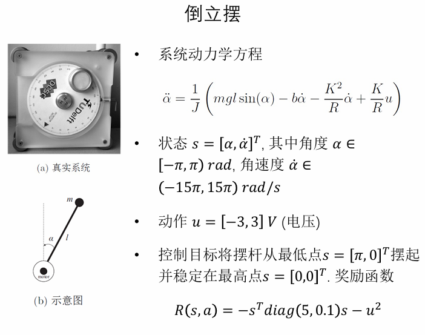

# 强化学习任务：倒立摆

[项目地址](https://github.com/luffydod/rl-inverted-pendulum)

## 任务描述



## 创建自定义环境

### 经典控制场景

​`gymnasium` 中实现了经典控制环境倒立摆，可以作为[参考](https://gymnasium.farama.org/environments/classic_control/pendulum/)。


​值得注意的是，这里是使用超过最大时间步数时截断环境来限制环境的步数。（本来想的是通过判断当前状态是否接近[0, 0]来返回是否完成任务。）

```python
def step():
    ...
    # truncation=False as the time limit is handled by the `TimeLimit` wrapper added during `make`
    return self._get_obs(), -costs, False, False, {}
```

​此外状态重置是通过均匀分布采样，而非每次从初始状态开始，仔细想这样做是增加探索，有利于学习。

```python
self.state = self.np_random.uniform(low=low, high=high)
```

### 设计实现

```python
DEFAULT_ALPHA = np.pi
DEFAULT_ALPHA_DOT = 15 * np.pi

class InvertedPendulumEnv(gym.Env):
    
    metadata = {
        "render_modes": ["human", "rgb_array"],
        "render_fps": 30,
    }
    
    def __init__(self, discrete_action = False, render_mode: Optional[str] = None):
        super(InvertedPendulumEnv, self).__init__()
        
        self.max_episode_steps = 200
        self.steps = 0
        self.n_actions = 11     # 离散动作数量
        self.max_voltage = 3.0  # 最大电压
        self.l = 0.3        # 摆杆长度 (m)
        self.m = 0.055      # 质量 (kg)
        self.J = (1/5) * self.m * self.l**2  # 转动惯量 (kg⋅m²)
        self.g = 10.0       # 重力加速度 (m/s²)
        self.b = 3.0e-6   # 阻尼系数 (N⋅m⋅s/rad)
        self.K = 0.0536   # 转矩常数 (N⋅m/A)
        self.R = 9.5      # 电机电阻 (Ω)
        
        self.render_mode = render_mode
        self.discrete_action = discrete_action
        
        self.last_u = 0
        self.screen_dim = 500
        self.screen = None
        self.clock = None
        self.isopen = True
        
        high = np.array([np.pi, 15*np.pi], dtype=np.float32)
        # 定义状态空间 [角度α, 角速度α_dot]
        self.observation_space = gym.spaces.Box(
            low=-high, high=high, dtype=np.float32
        )
        
        # 定义动作空间 (电压u)
        if self.discrete_action:
            self.discrete_actions = np.linspace(
                -self.max_voltage, self.max_voltage, self.n_actions
            )
            self.action_space = gym.spaces.Discrete(self.n_actions)
            
        else:
            self.action_space = gym.spaces.Box(
                low=-self.max_voltage, high=self.max_voltage,
                shape=(1,), dtype=np.float32
            )
    
    def step(self, action):
        self.steps += 1
        
        alpha, alpha_dot = self.state
        
        if self.discrete_action:
            u = self.discrete_actions[action]
        else:
            u = np.clip(action[0], -3.0, 3.0)  # 确保电压在[-3,3]范围内
        
        self.last_u = u # for rendering
        
        # 实现系统动力学方程
        # α̈ = (1/J)(mgl*sin(α) - bα̇ - (K²/R)α̇ + (K/R)u)
        alpha_ddot = (1/self.J) * (
            self.m * self.g * self.l * np.sin(alpha) - 
            self.b * alpha_dot - 
            (self.K**2/self.R) * alpha_dot + 
            (self.K/self.R) * u
        )
        
        # 使用欧拉方法进行数值积分
        dt = 0.01  # 时间步长
        alpha_dot_new = alpha_dot + alpha_ddot * dt
        alpha_new = alpha + alpha_dot * dt
        
        # 确保角度在[-π,π]范围内
        alpha_new = ((alpha_new + np.pi) % (2 * np.pi)) - np.pi
        
        self.state[0] = alpha_new
        self.state[1] = alpha_dot_new
        
        # R(s,a) = -s^T diag(5,0.1)s - u² -> R(s, a) = - 5 * alpha^2 - 0.1 * alpha_dot^2 - u^2
        reward = -(5 * alpha_new**2 + 0.1 * alpha_dot_new**2 + u**2)
        
        # 判断是否达到目标
        done = self.steps >= self.max_episode_steps
        
        return self.state, reward, done, {}
    
    def reset(self, *, seed: Optional[int] = None, options: Optional[dict] = None):
        super().reset(seed=seed)
        self.steps = 0

        if options is None:
            high = np.array([DEFAULT_ALPHA, DEFAULT_ALPHA_DOT])
            low = -high
            self.state = self.np_random.uniform(low=low, high=high)
        else:
            alpha = options.get("alpha")
            alpha_dot = options.get("alpha_dot")
            self.state = np.array([alpha, alpha_dot], dtype=np.float32)
            
        if self.render_mode == "human":
            self.render()
        return self._get_obs(), {}
    
    def _get_obs(self):
        alpha, alpha_dot = self.state
        return np.array([alpha, alpha_dot], dtype=np.float32)
    
    # render()和close()略，直接复制
```

## 持续更新中
